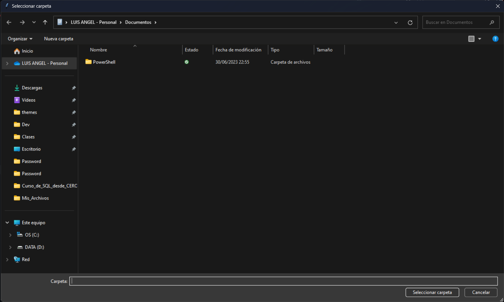

## Organizador de archivos por extensión

Este código en Python utiliza la biblioteca `tkinter` para crear una interfaz gráfica básica que permite al usuario seleccionar una carpeta de destino. Luego, organiza los archivos en esa carpeta en diferentes subcarpetas según su extensión.

### Pasos del código:

1. Importación de las bibliotecas necesarias:

   - `os`: Para operaciones de sistema de archivos.
   - `shutil`: Para mover los archivos a las carpetas de destino.
   - `tkinter`: Para crear una interfaz gráfica simple.
   - `filedialog`: Para mostrar un cuadro de diálogo de selección de carpeta.
   - `sys`: Para gestionar la salida del programa.

2. Creación de una ventana de diálogo de selección de carpeta utilizando `tkinter`. La ventana principal (`root`) se oculta para que solo aparezca el cuadro de diálogo.

3. Se solicita al usuario que seleccione una carpeta de origen.

4. Se definen las extensiones de archivo y las categorías en un diccionario. Cada categoría se asocia con una lista de extensiones de archivo.

5. Se itera a través de las categorías y se crea una subcarpeta para cada una en la carpeta de destino seleccionada. Si la subcarpeta ya existe, no se crea una nueva.

6. Se recorren los archivos en la carpeta de origen y se mueven a la subcarpeta correspondiente si su extensión coincide con una de las extensiones de la categoría.

7. Se muestra un cuadro de diálogo de información indicando que la organización de archivos se ha completado correctamente.

8. El programa se cierra utilizando `sys.exit()`.

Este código es útil para organizar archivos en una carpeta seleccionada por el usuario según sus extensiones, lo que facilita la gestión de archivos en un directorio desordenado.

### Uso del Script

1. Ejecute el script en un entorno Python.

2. Al ejecutar el script, aparecerá una ventana de diálogo que le pedirá que seleccione la carpeta que desea organizar.

3. Una vez seleccionada la carpeta, el script procederá a organizar los archivos en subcarpetas según sus extensiones.

4. Después de que la organización se complete con éxito, se mostrará un cuadro de diálogo de información indicando que los archivos se han organizado correctamente.

5. Puede cerrar el script después de confirmar que los archivos han sido organizados.

Este script es útil para mantener ordenados sus archivos según sus extensiones, lo que facilita la gestión de archivos en carpetas desordenadas.

